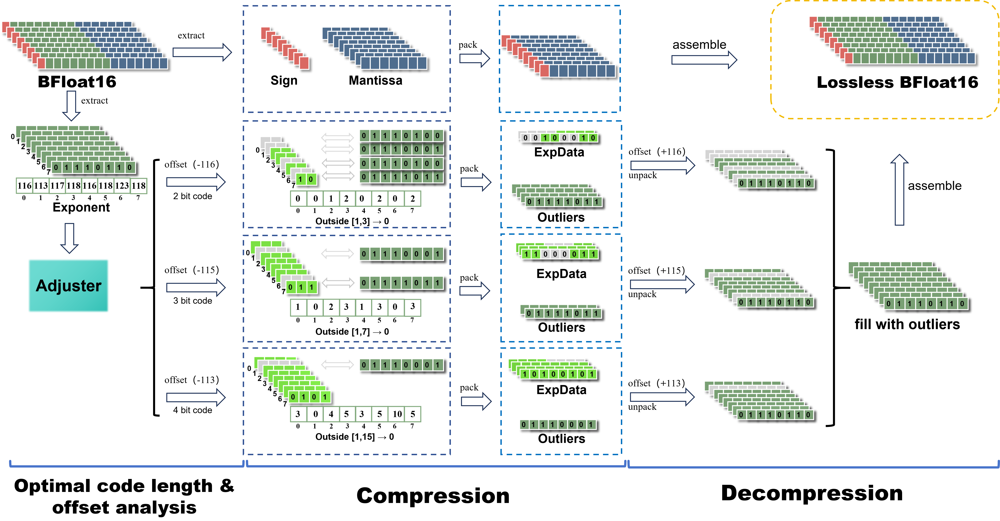

# AdaCode KV Cache Compression

AdaCode is a lossless KV-cache compression method for BFloat16 inference. It keeps the original outputs, reduces KV-cache memory, and uses contiguous exponent concentration to make the packing path GPU-friendly.

## Framework



The figure shows the runtime compression path. C4-based calibration runs offline to initialize the code length and exponent range. The runtime path then uses adaptive code-length selection with a lightweight adjuster and byte-aligned packing for fast decode.

## Usage

### 1. Export KV-cache statistics from C4

Use C4 as the proxy dataset to build the JSON config used by `model_configs.py`:

```bash
python export_kvcache_status.py \
  --datasets c4 \
  --freq-types exp \
  --output-prefix-name kv_test
```

This writes files such as `model_configs/kv_test_Qwen3-4B_exp.json`.
If you want the full raw bit histogram, use `--freq-types all`.

### 2. Run AdaCode

In this codebase, the path named `float11` corresponds to AdaCode in the paper.
The default recommended settings are:

- `block_size=128`
- `batch_size=1`
- `num_seqence=32`
- `max_new_tokens=128`
- `max_length=20480`
- `float11_layout=segmented_tiled`
- `float11_need_adjust=1`
- `float11_update_steps=128`

Run the sweep script with only the `float11` backend:

```bash
CACHE_IMPLS=float11 bash run_lossless_cache_length_sweep.sh qwen3_4B_config
```

To run all four paper models, omit the model argument:

```bash
CACHE_IMPLS=float11 bash run_lossless_cache_length_sweep.sh
```
